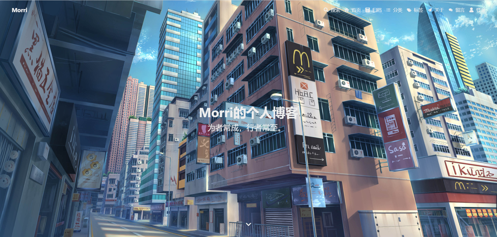
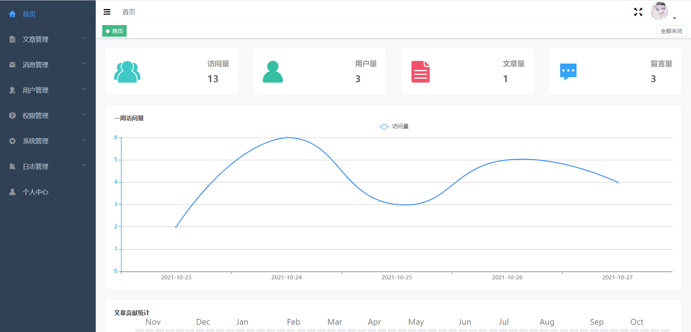
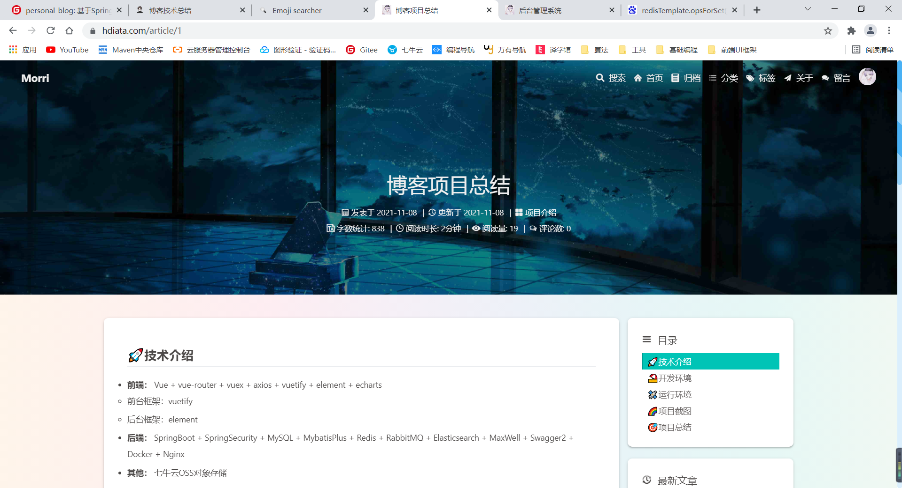

# 个人博客

## 介绍

<div align="center">基于SpringBoot + Vue开发的个人博客。</div>

<div align="center">
    <a href="https://gitee.com/lhMorri/personal-blog" style="text-decoration: none;" onMouseOver="text-decoration: none;">
         
         
         
         
         
         
         
         
         
    </a>
</div>
<div align="center">
    <a href="#在线地址">在线地址</a>|
    <a href="#技术介绍">技术介绍</a>|
    <a href="#开发环境">开发环境</a>|
    <a href="#目录结构">目录结构</a>|
    <a href="#项目特色">项目特色</a>|
    <a href="#运行环境">运行环境</a>|
    <a href="#快速开始">快速开始</a>|
    <a href="#注意事项">注意事项</a>|
    <a href="#项目总结">项目总结</a>|
    <a href="#项目截图">项目截图</a>
</div>


## 在线地址

**项目链接：** [https://www.hdiata.com](https://www.hdiata.com)

**后台链接：** [https://www.admin.hdiata.com](https://www.admin.hdiata.com)

- 账号：test@qq.com
- 密码：123456
- 此账号仅用于查看后台

**GitHub地址：**[https://github.com/LycorisradiataH/personal-blog](https://github.com/LycorisradiataH/personal-blog)

**Gitee地址：**[https://gitee.com/lhMorri/personal-blog](https://gitee.com/lhMorri/personal-blog)

## 技术介绍

- **前端：** Vue + vue-router + vuex + axios + vuetify + element + echarts
  - 前台框架：vuetify
  - 后台框架：element

- **后端：** SpringBoot + SpringSecurity + MySQL + MybatisPlus + Redis + RabbitMQ + Elasticsearch + MaxWell + Swagger2 + Docker + Nginx
- **其他：** 七牛云OSS对象存储 

## 开发环境

| 开发工具              | 说明              |
| --------------------- | ----------------- |
| Intellij IDEA         | Java开发工具IDE   |
| VS Code               | Vue开发工具IDE    |
| Navicat               | MySQL远程连接工具 |
| Redis Desktop Manager | Redis远程连接工具 |
| Xshell                | Linux远程连接工具 |
| Xftp                  | Linux文件上传工具 |

| 环境依赖      | 版本   |
| ------------- | ------ |
| JDK           | 1.8    |
| Maven         | 3.6.3  |
| MySQL         | 8.0.26 |
| Redis         | 6.0.16 |
| RabbitMQ      | 3.8.23 |
| Elasticsearch | 7.9.2  |
| Vue-cli       | 4.5.13 |

## 目录结构

1.  前端项目位于blog-vue目录下
    - blog为前台项目
    - blog-admin为后台项目
2.  后端项目位于blog-springboot目录下
3.  SQL文件位于根目录下
    - <span style='color: red'>注</span>：MySQL版本需要 <span style='color: red'>8.0</span> 以上
4.  接口文档地址：
    - 启动后端项目访问：[http://127.0.0.1:8080/swagger-ui.html](http://127.0.0.1:8080/swagger-ui.html)
5.  拉取项目的注意事项：
    - 需要修改后端项目的 `application.yml` 配置文件中的信息为自己本机的信息
    - OSS对象存储功能需要自行开启
    - 后台可以登录管理员账号 admin@qq.com，密码：123456，进行修改数据。

```
blog
|--blog-springboot
|  └--hua_blog					// 后端应用
|  |  |--java					// 应用
|  |  |  |--common				// 公共模块
|  |  |  |  |--annotation		// 自定义注解
|  |  |  |  |--aspect			// aop模块
|  |  |  |  |--constant			// 常量模块
|  |  |  |  |--consumer			// MQ消费者模块
|  |  |  |  |--enums			// 枚举模块
|  |  |  |  |--exception		// 自定义异常
|  |  |  |  └--handler			// 处理器模块
|  |  |  |--config				// 配置模块
|  |  |  |--controller			// 控制器模块
|  |  |  |--mapper				// 数据访问模块
|  |  |  |--pojo				// POJO模块
|  |  |  |  |--dto				// 数据传输对象
|  |  |  |  |--entity			// 数据对象
|  |  |  |  └--vo				// 展示对象
|  |  |  |--service				// 业务逻辑模块
|  |  |  └--util				// 工具类模块
|  |  └--resource				// 资源
|  |  |  |--mapper				// 数据访问映射文件
|  |  |  └--application.yml		// 配置文件
└--blog-vue						// 前端应用
|  |--blog
|  |  |--public					// 静态资源，打包时不会被压缩
|  |  └--src					// 应用
|  |  |  |--api					// api接口
|  |  |  |--assets				// 静态资源，打包时会被压缩
|  |  |  |--components			// 组件
|  |  |  |--plugins				// 插件
|  |  |  |--request				// 请求
|  |  |  |--router				// 路由
|  |  |  |--store				// 状态管理
|  |  |  |--views				// 页面
|  |  |  |--App.vue				// 主组件
|  |  |  └--main.js				// 入口js文件
|  |  └--vue.config.js			// 配置文件
|  └--blog-admin
|  |  |--public					// 静态资源，打包时不会被压缩
|  |  └--src					// 应用
|  |  |  |--assets				// 静态资源，打包时会被压缩
|  |  |  |--components			// 组件
|  |  |  |--layout				// 组件
|  |  |  |--router				// 路由
|  |  |  |--store				// 状态管理
|  |  |  |--views				// 页面
|  |  |  |--App.vue				// 主组件
|  |  |  └--main.js				// 入口js文件
|  |  └--vue.config.js			// 配置文件
```

## 项目特色

1.  前台参考"Hexo"的"Butterfly"设计，美观简洁，响应式体验好。
2.  后台参考"element-admin"设计，侧边栏，历史标签，面包屑自动生成。
3.  文章采用Markdown编辑器，写法简单。
4.  评论支持表情输入回复等，样式参考Valine。
5.  前后端分离部署，适应当前潮流。
6.  留言采用弹幕墙，更加炫酷。
7.  支持代码高亮和复制，图片预览等功能，提升用户体验。
8.  搜索文章支持高亮分词，响应速度快。
9.  自动生成文章目录、提供推荐文章等功能，优化用户体验。
10.  使用aop注解实现日志管理。
11.  支持动态权限修改，采用RBAC模型，前端菜单和后台权限实时更新。
12.  后台管理支持修改背景图片，博客配置等信息，操作简单。
13.  代码遵循阿里巴巴开发规范，利于开发者学习。

## 运行环境

- **推荐配置：**
  - **服务器：** 腾讯云2核4G 带宽8M CentOS 7.6

  - **对象存储：** 七牛云OSS

- **最低配置：** 
  - **服务器：** 1核2G服务器（关闭 Elasticsearch）

## 快速开始

### 项目环境

### 项目配置

详情请查看文章👉 [博客项目配置](https://www.hdiata.com/article/2)

### 项目部署

## 后续计划

- [x] 搜索策略（可选择是 MySQL 或 Elasticsearch 搜索文章）

- [ ] 上传策略（可选择上传到本地 或 对象存储OSS）
- [ ] 第三方登录
- [ ] 在线聊天室
- [ ] 音乐播放器

## 注意事项

- 项目拉取之后，后端配置文件需要修改为自己的本地或服务器ip，账号密码也需要修改
- 邮箱配置需要自己申请
- Elasticsearch需要先创建索引
- 七牛云对象存储也需要自己申请，也可以使用上传到本地

## 项目总结

这是我的第一个完整的项目且部署到服务器，中途因为技术选型也重新创建过项目，最开始设计数据库表字段也没有思考全面，到后期也增删过几个字段，但总体是不错的，最后也顺顺利利的完成了博客项目的编写及部署。因为是第一个项目，所以有些许bug请见谅。

## 项目截图







[返回顶部](#个人博客)

